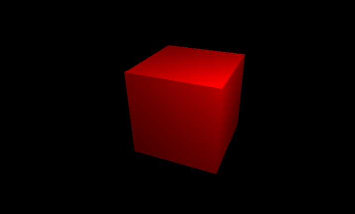
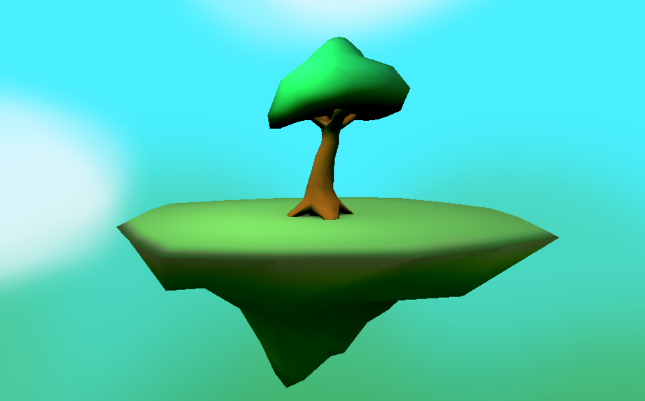
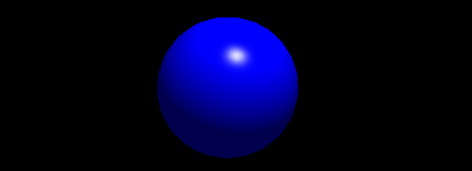
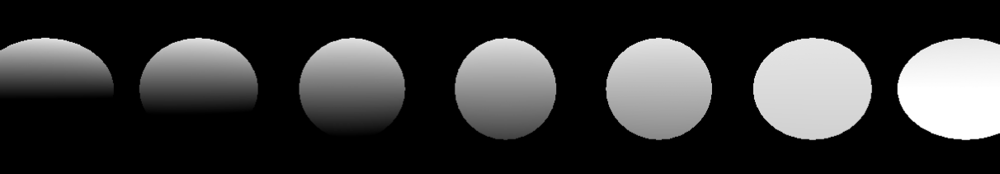
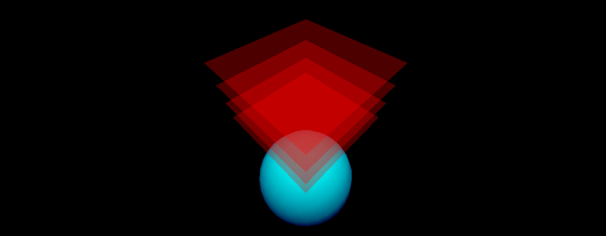

# x3

3D Engine for the Love 2D framework / Castle


### Overview

x3 is a renderer  for 3D games written primarily for use with Castle, but compatible with Love 2D 11. It features a math library designed to reduce garbage collection, a retained-mode node-based scene graph, hardware instancing and a simple but flexible material system that can support custom shaders. 


Planned features not yet implemented include shadow mapping, normal mapping, gltf loading and PBR materials.


### Hello Box



```lua
local x3 = require('x3');

local scene = x3.newEntity();
local camera = x3.newCamera();
local width, height = love.graphics.getDimensions();

-- Create a canvas to render on
local canvas3D = x3.newCanvas3D(width, height);

-- Create a red box
local box = x3.newEntity(
        x3.mesh.newBox(1,1,1),
        x3.material.newLit({
                baseColor = {1,0,0}
        })
 )

scene:add(box);

-- Add a point light to the scene
local light = x3.newPointLight({
	color = {1,1,1}
})

light:setPosition(3, 3, 3);
scene:add(light);

--Configure the camera
camera:setPosition(2, 3, 5);
local cameraTarget, cameraUp = x3.vec3(0,0,0), x3.vec3(0,1,0);
camera:lookAt(cameraTarget, cameraUp);
-- FOV, Aspect Ratio, Near, Far
camera:setPerspective(90, height/width, 0.5, 100.0);

function love.draw()
    --Render 3D scene to canvas
    x3.render(camera, scene, canvas3D);
    --Display canvas on screen
	x3.displayCanvas3D(canvas3D, 0, 0);
end
```

### Loading Assets



x3 Currently only supports .obj format, but gltf support is in the works. 

The Obj loader can support loading multiple named objects inside an .obj file, referenced by the .meshesByName table. If only one Mesh is present, simply use .mesh 

```lua
local objScene = x3.loadObj("models/island/island.obj");
local objTexture = love.graphics.newImage("models/island/island.png");

local island = x3.newEntity(
    --mesh
    objScene.meshesByName["island_mesh"],
    --material
    x3.material.newLit({
            baseTexture = objTexture,
    })
);
```


### Positioning Objects

All entities in x3 exist in a scene graph. This means that an entity can have parent entities and/or child entities, and the transform of a parent entity affects the transforms of child entities. For example, we can create a boat entity and add a sail and rudder to it:

```lua
local boat = x3.newEntity(boatMesh, boatMaterial);
local sail = x3.newEntity(sailMesh, sailMaterial);
local rudder = x3.newEntity(rudderMesh, rudderMaterial);

boat:add(sail, rudder);
```

Now, whenever we move the boat, the sail and rudder will move along with it. The position of the sail and rudder should be local, or offset, from the position of the boat, ie:

```lua
boat:setPosition(123, 0, 14) --Boat's position is in world coordinates
sail:setPosition(0, 2, 0) --Sail is offset from the boat's center
```

There are many functions for moving, rotating and scaling objects available. See the API documentation for complete list. Here are just a few examples

```lua
box:setPosition(1,2,3);
box:setPosition(x3.vec3(1,233,99));

box:setScale(0.5);
box:setScale(3,3,3);

box:setRotation(x3.quat(0,0,0,1)) --Rotations are stored as quaternions

local upAxis = x3.vec3(0,1,0);
box:resetRotation();
box:rotateAxis(upAxis, 2.3); -- Rotate around upAxis by 2.3 radians

box:rotateRelZ(math.pi) -- Rotate pi radians around the relative z axis (relative to parent)

box:slerp(otherBox:getRotation(), 0.5) -- Rotate halfway (0.5) between current rotation and otherBox rotation

box:applyVelocity(x3.vec3(0,0,1), dt)
```

You can also use the **:show()** and **:hide()** functions to turn visibility of an entity on and off.

### Materials and Lighting

The material system in x3 is designed around flexibility, performance and ease of use for artists, rather than physical accuracy. 

The two basic materials are lit and unlit. (Unlit material are not affected by point lights and do not use specular). This standard material uses a phong shader supporting base (diffuse) color, specular and emissive. **shininess** controls the specular exponent. For base, emissive and specular,  a color and/or a texture can be specified. **lightmapTexture** can be assigned to a lightmap or ambient occlusion texture. Normal mapping and reflection maps for PBR are coming soon!




```lua
local ball = x3.newEntity(
	x3.mesh.newSphere(1, 24, 24),
    x3.material.newLit({
            baseColor = {0,0,1}, -- {r,g,b}
            specularColor = x3.vec3(1,1,1), -- can use vec3 or table
            shininess = 30,
            emissiveColor = x3.hexColor(0x0000FF) -- same as {0,0,1}
        })
)
```

With Textures:

```lua
local ball = x3.newEntity(
	x3.mesh.newSphere(1, 24, 24),
    x3.material.newLit({
            baseTexture = love.graphics.newImage("ball_diffuse.png"),
            specularTexture = love.graphics.newImage("ball_specular.png"),
            shininess = 10,
            emissiveTexture = love.graphics.newImage("ball_emissive.png"),
            lightmapTexture = love.graphics.newImage("ball_AO.png")
        })
)
```


Hemisphere lighting can be achieved using the **hemiColors** and **hemiDirection** properties of materials (either lit or unlit). hemiColor[1]  is the color of light pointing away from hemiDirection and hemiColor[2] is the light pointing towards hemiDirection. Hemisphere lighting is a fast and easy way to add directional and ambient lighting effects to a scene, and can be configured to make lighting that is less harsh than ordinary directional lighting. For outdoor scenes, try making the hemiColors greenish and bluish for grass and sky respectively.



```lua
x3.material.newUnlit({
	-- same as {{0.2,0.2,0.2}, {0.8,0.8,0.8}}
    hemiColors = {x3.COLOR.GRAY2, x3.COLOR.GRAY8},
    -- same as {0,1,0}
    hemiDirection = x3.vec3(0,1,0)
})
```


### Custom Shaders

The following simple shader just draw pure red.  fragShade should be glsl code that modifies the vec4 **outColor** 

```lua
local customShaderOpts = {
        defines = {
            LIGHTS = 0,
            INSTANCES = 1 
        },

        fragShade = [[
            outColor = vec4(1.0, 0.0, 0.0, 1.0);
        ]]
    };

local customShader = x3.shader.newCustom(customShaderOpts);
local material = x3.material.newCustom(customShader);
```

The following global variables are available to fragShade:

```
varying vec3 v_WorldNormal;
varying highp vec3 v_WorldPosition;
varying highp vec2 v_TexCoord0;

#if INSTANCES
   	 	varying vec4 v_InstanceColor;
#endif

extern highp vec3 u_WorldCameraPosition;
extern highp float u_Time; //Time in seconds

#if LIGHTS
        extern int u_NumPointLights;
        extern vec3 u_PointLightPositions[4];
        extern vec3 u_PointLightColors[4];
        extern float u_PointLightIntensities[4];
#endif
```


The **defines** table allows us to add preprocessor tokens to the glsl shader. LIGHTS and INSTANCES are built-in defines used by the x3 material system that should be either set to 0 or 1. You are free to add any others.

You can also specify uniforms (also known as externs in love) for each material using the shader:

```lua
local customShaderOpts = {
        defines = {
            LIGHTS = 0,
            INSTANCES = 1 
        },
        
        fragHead = [[
        	extern float u_MagicValue;
        ]],

        fragShade = [[
            outColor = vec4(sin(u_MagicValue), 0.0, 0.0, 1.0);
        ]]
    };

local customShader = x3.shader.newCustom(customShaderOpts);
local material1 = x3.material.newCustom(customShader, {
        u_MagicValue = 5
    });
local material2 = x3.material.newCustom(customShader, {
       u_MagicValue = 23433.4
    });
```

Any value supported by love's **shader:send(...)** can be assigned in the list of uniforms passed to material.newCustom, just make sure to use the love equivalents for vectors and matrices instead of the x3 math library.

### Transparency and Render Order



Currently, transparency is only supported in custom shaders as above by setting outColor.a to a value less than 1.0.

For transparent objects, it is important to render them back-to-front from the camera's perspective for proper alpha blending. This can be accomplished by setting the **renderOrder** propery of an entity with **:setRenderOrder(renderOrder)**. A renderOrder of 1 will render first, then 2, then 3 etc... 

If renderOrder is not specified, objects are binned and rendered by shader to reduce shader program switching on the gpu for a performance improvement.

### Instancing

Hardware instancing allows rendering many duplicates of an entity with different transforms in a single draw call, greatly improving performance. Instancing in x3 is very easy:

```lua
monkey:setNumInstances(100);

for i = 1,box:getNumInstances() do

  monkey:getInstance(i):setPosition(i, 0, 0);

end
```

All entity tranform functions are supported by instances, and instances additionally have setColor(r,g,b) and setAlpha(a) available. 

Currently, instancing does not create instances of an entity's children, this may be modified in a future release. 

### Math

While it may seem most natural to write out vector arithmetic as 

``` 
local newPosition = oldPosition + velocity * dt;
```

this unfortunately cannot be done in Lua without allocating unnecessary data for the garbage collector. Instead, math in x3 looks more like:

```lua
newPosition:copy(oldPosition);
newPosition:addScaled(velocity, dt);
```

Operators like **add**, **sub** and **mul** are all done in place on the vector they are called on rather than creating new objects.

Additionally, vec3s should be created outside of the game loop to avoid allocating new memory on every frame

```lua
local newPosition = x3.vec3();

local updateObject = function(object, dt)
  newPosition:copy(object:getPosition());
  newPosition:addScaled(object.velocity, dt);
    
  if (newPosition:length() > 24) then
       newPosition:setLength(24); --same as :normalize(); :scale(24)
  end
    
  object:setPosition(newPosition);      

end
```

The basic math types in x3 are **vec3**, **quat**, **mat4** and **ray**. mat4 are column-major 4x4 matrices.


